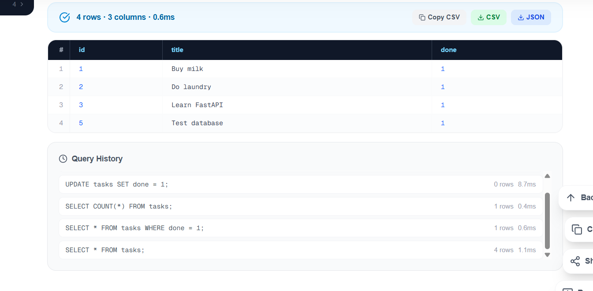
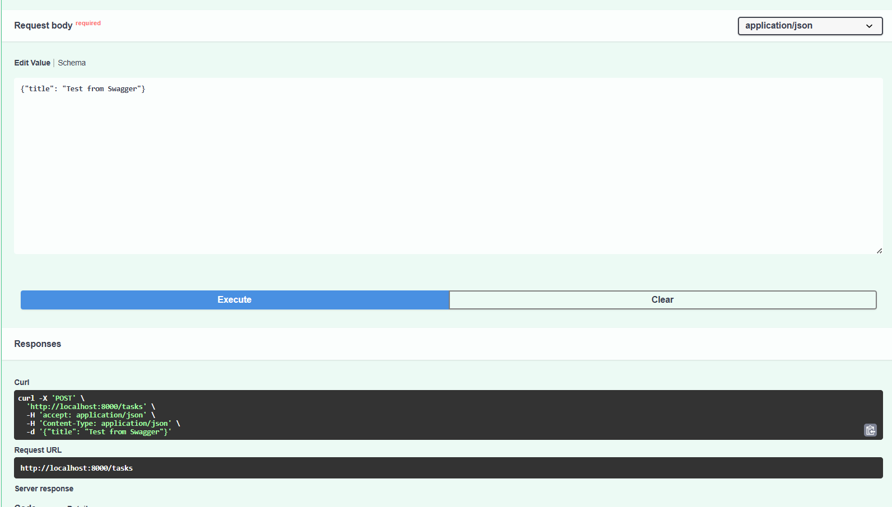

# To-Do List CRUD API (FastAPI + SQLite)

A lightweight RESTful CRUD API built with Python and FastAPI for managing a to-do list. The API uses SQLite for persistent data storage, so tasks remain available even after the server is restarted. Built for the FlyRank Week 3 Assignment. The API provides complete CRUD operations with validation, error handling, and interactive Swagger documentation.

## How to Install & Run

You can get this API running on your local machine in under a minute. Run these commands in your terminal:

```bash
# 1. Clone this repository
git clone https://github.com/EeshaFatima3/todo-crud-api.git
cd todo-crud-api

# 2. Install the required dependencies
pip install fastapi uvicorn

# 3. Start the server
python -m uvicorn main:app --reload --port 8000
```

The SQLite database (`tasks.db`) is automatically created when the application starts. The database table is also created automatically if it does not already exist.

Once the server is running, open your web browser and navigate to `http://localhost:8000/docs` to interact with the API using the Swagger UI.

---

## API Endpoints Table

| Method | Endpoint      | Description     | Expected Status                   |
| ------ | ------------- | --------------- | --------------------------------- |
| GET    | `/`           | API Metadata    | `200 OK`                          |
| GET    | `/health`     | Health Check    | `200 OK`                          |
| GET    | `/tasks`      | List all tasks  | `200 OK`                          |
| GET    | `/tasks/{id}` | Get single task | `200 OK` / `404 Not Found`        |
| POST   | `/tasks`      | Create task     | `201 Created` / `400 Bad Request` |
| PUT    | `/tasks/{id}` | Update task     | `200 OK` / `400` / `404`          |
| DELETE | `/tasks/{id}` | Delete task     | `204 No Content` / `404`          |

---

## Database

This version of the API uses SQLite instead of an in-memory Python list.

SQLite was chosen because it is lightweight, requires no separate database server, and stores the application's data in a single database file.

The database file is:

```text
tasks.db
```

It is stored in the project directory and is automatically created when the application starts.

The `tasks` table contains the following columns:

| Column  | Type    | Description            |
| ------- | ------- | ---------------------- |
| `id`    | INTEGER | Unique task ID         |
| `title` | TEXT    | Task title             |
| `done`  | BOOLEAN | Task completion status |

On the first run, three example tasks are automatically inserted into the database. They are only inserted when the table is empty.

Because tasks are stored in SQLite, data persists even after stopping and restarting the FastAPI server.

---

## Example SQL Query

The database can also be viewed and queried using a SQLite database viewer such as DB Browser for SQLite.

Example query:

```sql
SELECT * FROM tasks WHERE done = 1;
```

This query returns all completed tasks stored in the database.

---

## Database Screenshot



---

## Sample Request & Output (`curl -i`)

**Request:**

```bash
curl.exe -i -X DELETE http://localhost:8000/tasks/1
```

**Output:**

```http
HTTP/1.1 204 No Content
date: Sat, 08 Aug 2026 15:21:05 GMT
server: uvicorn
```

---

## Swagger UI Screenshot



---

## Persistence

Unlike the previous in-memory version, this API stores tasks in a SQLite database.

Tasks created, updated, or deleted through the API are reflected in the database and remain available after the server is restarted.
